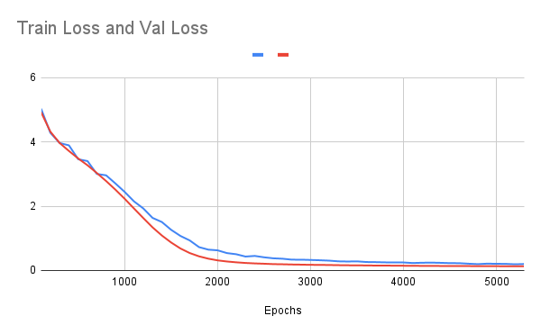

# Custom GPT from Scratch using PyTorch

[](LICENSE)
[](https://huggingface.co/khotveer1/custom-gpt-pytorch-shakespeare)

This repository provides a **minimal and educational implementation** of a GPT-style transformer model trained from scratch on Shakespearean text. The objective is to build a deeper understanding of how GPT works at its core without using pre-trained models or high-level APIs.

---

## Related Article

**Read the full tutorial article here:**  
[Understanding GPT by Training One from Scratch using PyTorch](https://your-blog-link.com)

---

## Repo Highlights

- Trained GPT-style model on character-level Shakespeare data.
- Custom BPE tokenizer used for encoding/decoding.
- Model + tokenizer hosted on Hugging Face Hub.
- Visualizations and reproducible notebooks included.
- Supports script and notebook workflows.

---

## Training Loss Curve

Below is the loss trend of the model during training over multiple epochs.



---

## Quickstart

**1. Load Pretrained Model from Hugging Face**

To download the trained model (`.pth`) and tokenizer (`.pkl`) from Hugging Face and place them inside `./saved_models`, run:

```bash
cd saved_models
python load_model.py
```

This will download:

- model_shakespeare_new_v5_latest.pth
- encoder_shakespeare_v5.pkl

## Option A: Run Using Notebooks (Recommended)
Navigate to the end_to_end folder:
**Train the model:**
01_train_gpt_from_scratch.ipynb

**Generate text from the trained model:**
02_inference_generate_text.ipynb

These notebooks are standalone and load everything required to train and run inference.

## Option B: Run from Scratch (Notebook + Code)
Clone the repo and execute notebooks directly from the root:

```bash
git clone https://github.com/khotveer/custom-gpt-using-pytorch.git
cd custom-gpt-using-pytorch
```
Run 01_train_gpt_from_scratch.ipynb to train a new model.
Run 02_inference_generate_text.ipynb to generate predictions.

## Model Info

- Architecture: GPT-style transformer (n_layer=8, n_head=8, n_embd=512)
- Dataset: Shakespeare (character-level)
- Tokenization: Custom BPE tokenizer
- Framework: PyTorch

## Repo Structure
```bash
.
├── src/                    # Core training and model code
├── data/                   # Input dataset (Shakespeare)
├── end_to_end/             # Full training and inference notebooks
├── saved_models/           # Load pretrained model from HF Hub
├── temp/                   # Misc files and intermediate outputs
├── load_model.py           # Pull model/tokenizer from Hugging Face
├── requirements.txt
└── README.md
```
## 🔗 Resources
- [Model on Hugging Face](https://huggingface.co/khotveer1/custom-gpt-pytorch-shakespeare)
- [Detailed Walkthrough (Article)](https://medium.com/p/ad1425a0ae05/edit)
